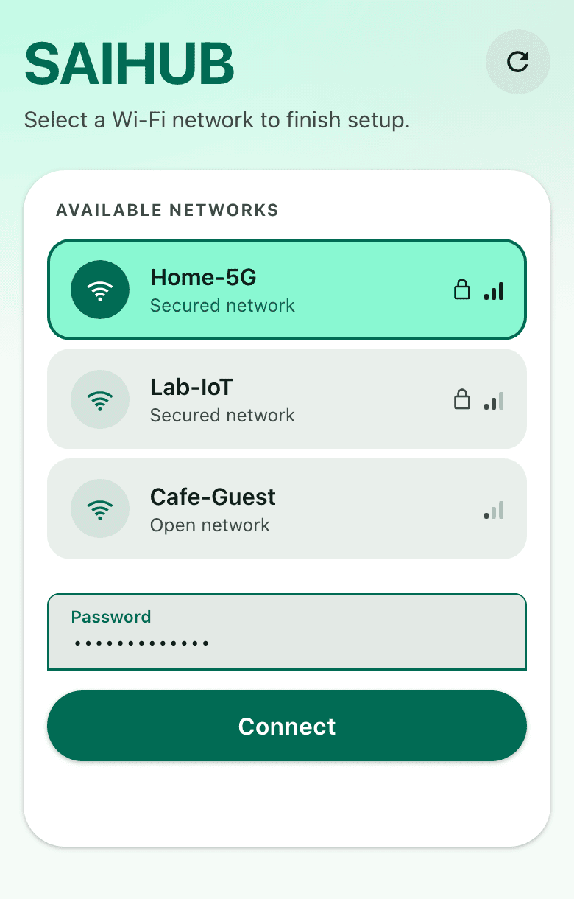
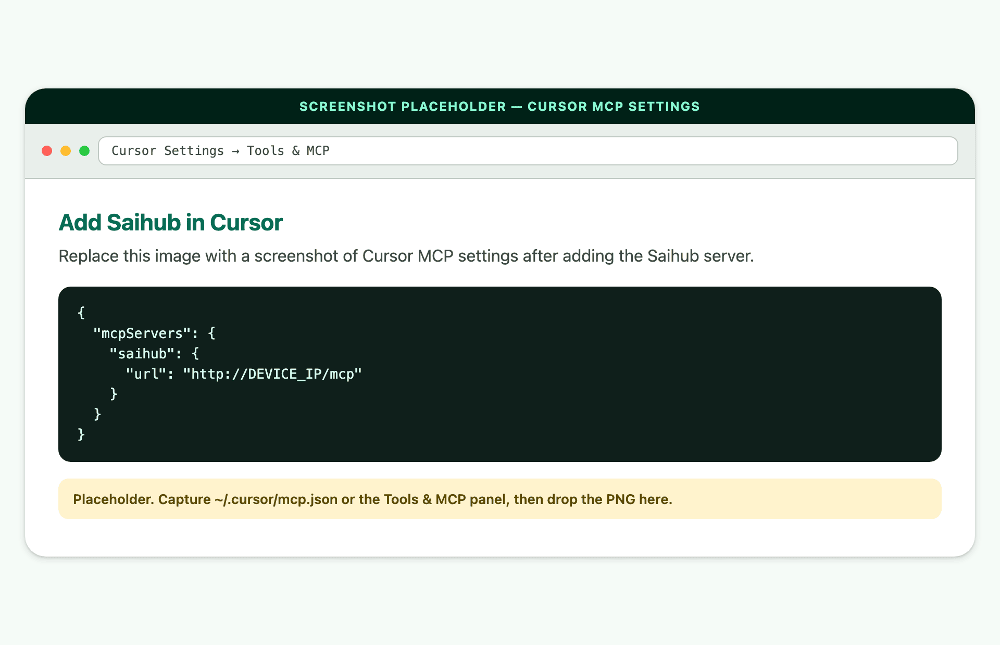
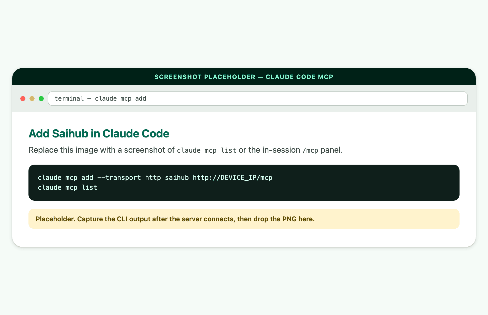
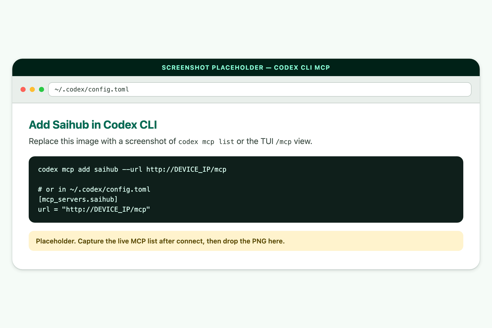
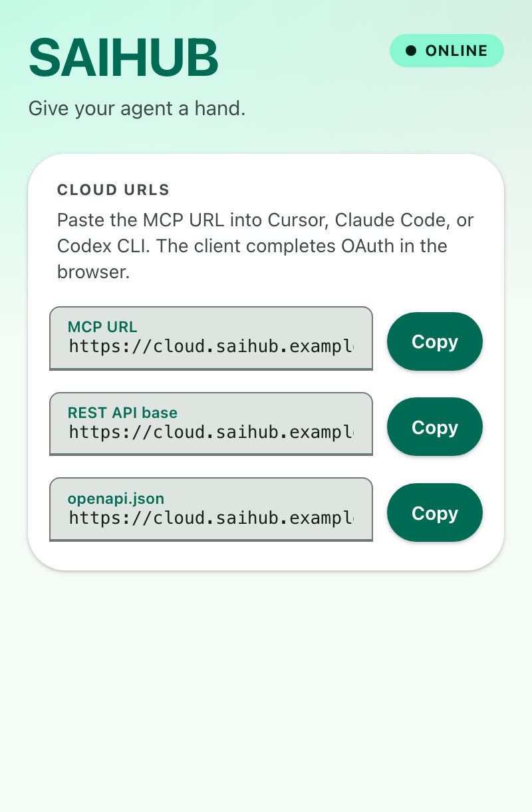
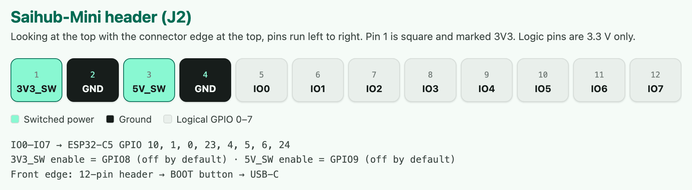

# Saihub cookbook

Flash the board, join Wi-Fi, and hand an MCP URL to Cursor, Claude Code, or Codex CLI.

[中文手册](cookbook.zh.md) · [README](../README.md)

## 1. Flash firmware

1. Download the firmware `.bin` from [GitHub Releases](https://github.com/xqe2011/saihub/releases). That file is a **merged** image for ESP32-C5 (4 MB flash).
2. Open the official [ESP web flasher](https://espressif.github.io/esptool-js/) in **Chrome** or **Edge** (Web Serial is required).
3. Put the board in **download mode** (see below), click Connect, pick the USB serial port.
4. Flash the `.bin` at address **`0x0`**. Chip: **ESP32-C5**. Flash mode DIO, 80 MHz, 4 MB is fine if the tool asks.
5. When it finishes, unplug USB and plug it back in **without** holding BOOT so the new firmware runs.

Use a **USB data cable**, not a charge-only cable.

### Download mode

Saihub-Mini has native USB and a BOOT button (GPIO28) beside USB-C. There is no EN / RESET button on the board. The chip enters the ROM serial bootloader when GPIO28 is held low at reset.

Do this:

1. Unplug USB.
2. Hold the small **BOOT** button (between the 12-pin header and USB-C).
3. Plug USB-C in while still holding BOOT.
4. Keep holding until the web flasher connects, then release.

If the board is already powered and the flasher cannot sync:

- Keep holding **BOOT**.
- Briefly short **TP1** and **TP2** (EN / GND reset pads on the top of the PCB), then release BOOT after the flasher connects.

Empty boards often enumerate in download mode already — try connecting first, then use the hold-BOOT sequence if it times out.

> Clicking BOOT after firmware is running starts **Wi-Fi pairing**, not download mode. Download mode is only at reset with BOOT held.

## 2. Join Wi-Fi

1. After a normal boot, **click BOOT once**. The board raises an open access point named `SAIHUB-` plus the last three bytes of its MAC, for example `SAIHUB-a1b2c3`.
2. Connect your phone or laptop to that AP (no password).
3. A captive-portal page should open. If it does not, browse to [http://192.168.4.1/wifi/page](http://192.168.4.1/wifi/page).
4. Pick your network, enter the password, tap **Connect**. Wait until it shows **Device IP**.
5. Write that IP down. The pairing AP closes a few seconds after a successful join. Click BOOT again if you need to cancel pairing.



The board reconnects to the saved network on later boots. Click BOOT any time you need to change Wi-Fi.

On the LAN you now have:

| URL | For |
| --- | --- |
| `http://<device-ip>/` | Human control UI |
| `http://<device-ip>/mcp` | MCP (Streamable HTTP) |
| `http://<device-ip>/openapi.json` | REST description |

## 3. Connect an MCP client

Replace `DEVICE_IP` with the address from the pairing page. Same LAN as the board.

After you add the server, ask the agent something concrete: *“List pins, set pin 0 as a digital output, and drive it high for one second.”*

### Cursor

Settings → **Tools & MCP**, or edit `~/.cursor/mcp.json` / `.cursor/mcp.json`:

```json
{
  "mcpServers": {
    "saihub": {
      "url": "http://DEVICE_IP/mcp"
    }
  }
}
```



### Claude Code

```bash
claude mcp add --transport http saihub http://DEVICE_IP/mcp
claude mcp list
```

Project-wide (writes `.mcp.json`):

```bash
claude mcp add --scope project --transport http saihub http://DEVICE_IP/mcp
```



### Codex CLI

```bash
codex mcp add saihub --url http://DEVICE_IP/mcp
```

Or in `~/.codex/config.toml`:

```toml
[mcp_servers.saihub]
url = "http://DEVICE_IP/mcp"
```

In the TUI, `/mcp` shows whether the server is live.



### Tools the agent can call

GPIO: `list_pins`, `configure_pins`, `get_pin_levels`, `set_pin_levels`, `pulse_pins`, `get_pin_pwms`, `set_pin_pwms`, `trace_pins`.

Power: `get_output_power_state`, `set_output_power_state` (`3v3` / `5v`).

UART: `list_uarts`, `configure_uart`, `uart_transmit`, `uart_receive`, `uart_flush`.

Scripts: `run_script` — sandboxed Lua 5.4 with the same pin/power tools plus `sleep(us)`.

Full schemas: [`mcp.json`](../mcp.json). REST twin: [`openapi.json`](../openapi.json).

## 4. Hosted cloud relay (optional)

If you **buy a board from us**, we host the Cloudflare relay. After the board is on Wi-Fi it keeps a WebSocket to the cloud. You can use Saihub from a cafe, another office, or a CI runner — not only the local LAN.

1. After cloud authentication succeeds, the serial log prints the landing page URL:

   `https://<hosted-origin>/cloud/landing/<digest>/page`

2. Open that URL. It shows whether the board is online, and has copy buttons for:

   - MCP URL — `https://<hosted-origin>/device/<digest>/mcp`
   - REST API base — `https://<hosted-origin>/device/<digest>`
   - `openapi.json` — `https://<hosted-origin>/device/<digest>/openapi.json`

3. Paste the MCP URL into Cursor, Claude Code, or Codex CLI the same way as the LAN URL. The client runs OAuth in the browser; you do not paste a long-lived token by hand.



Self-hosted workers use the same URL shape; the serial log prints the landing page for your origin. See the next section.

## 5. Self-host the Cloudflare relay

The worker in `cloud/cloudflare/` proxies MCP and REST to the board over a Durable Object, with OAuth for MCP clients. The relay protocol itself is server-agnostic — message formats, auth handshake, and limits are documented in the [design notes](design-notes.md).

### Deploy

You need a Cloudflare account, Node or [Bun](https://bun.sh), and [Wrangler](https://developers.cloudflare.com/workers/wrangler/).

```bash
cd cloud/cloudflare
bun install          # or: npm install
npx wrangler login
openssl rand -hex 32
npx wrangler secret put ROUTING_TOKEN_SECRET
# paste the random hex when prompted
npx wrangler deploy
```

Wrangler prints a `*.workers.dev` origin, for example `https://saihub-cloud.<account>.workers.dev`. Optional: attach a custom domain in the Cloudflare dashboard.

### Point firmware at your worker

In `main/include/config.h` set the WebSocket origin (**`wss://`**, no path):

```c
#define CONFIG_CLOUD_URL "wss://saihub-cloud.<account>.workers.dev"
```

Rebuild and flash with ESP-IDF ≥ 5.5:

```bash
idf.py set-target esp32c5
idf.py build
idf.py merge-bin   # merged image for the web flasher, flash at 0x0
```

Building for a board other than Saihub-Mini? Remap the pins first: [bring your own board](bring-your-own-board.md).

Once the board reboots, the device connects to:

`wss://<origin>/cloud/device/<digest>`

MCP clients use:

`https://<origin>/device/<digest>/mcp`

`<digest>` is the board’s Base58Check device id (from the hardware ECDSA public key). After the board authenticates, the serial log prints the landing page at `https://<origin>/cloud/landing/<digest>/page` — open that to copy the MCP, REST, and OpenAPI URLs.

`ROUTING_TOKEN_SECRET` never leaves Wrangler secrets. Do not commit it.

Worker routes, local dev with a fake device, and tests: [build.md](build.md).

## 6. Pins, power, and example jobs



Quick reference — J2 left to right: `1:3V3_SW  2:GND  3:5V_SW  4:GND  5:IO0 … 12:IO7`; IO0–IO7 map to ESP32-C5 GPIO **10, 1, 0, 23, 4, 5, 6, 24**; both rails default **off**. Full pinout table, power budget, and test points: [hardware.md](hardware.md).

### Give the agent a hand on the bench

Wire Saihub’s GPIO and UART to a DUT. Then ask:

> Configure pins 0–2 as inputs with pull-ups. Trace them for two seconds while I press the DUT button. Summarize the edges, then bit-bang a reset pulse on pin 3.

That is GPIO + pulse + `trace_pins` (a small logic analyzer) + optional UART to the debug console. PWM can clock a line the DUT expects.

### Agent-ready IO

**Servo.** 5 V rail on, PWM on a data pin (typical 50 Hz, ~2.5–12.5% duty for 0–180°). Ask the agent to sweep and stop on a photo-gate GPIO.

**Light.** PWM an LED or a MOSFET dimmer. Slow ramps belong in `run_script` with `sleep`.

**Electromagnetic relay.** Enable 5 V if the coil needs it, configure the pin as a digital output, set it high to close. Use it as a smart switch for a pump, a door lock, a heater, or a test-fixture mains relay (keep mains on the relay side, never on Saihub pins).

**Safety.** 5 V / 3 A adapter and cable for real loads. Keep outputs off on unknown USB ports. Nominal rail protection is about 1 A, not a guaranteed continuous 1 A.
