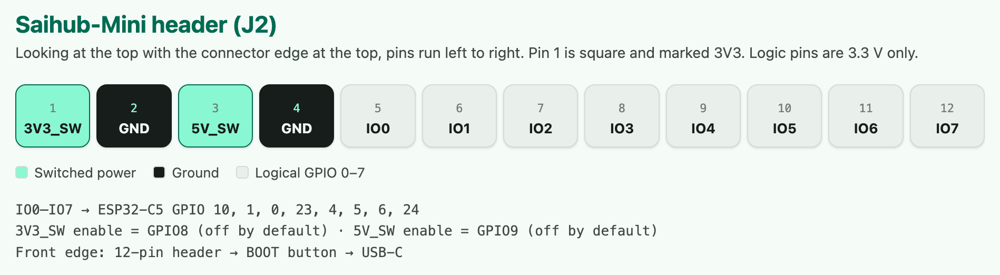

# Saihub-Mini 硬件文档

一块 48 × 28 mm 的双层 ESP32-C5 IO 板：USB-C 接口、一个 BOOT 按键、一排 12 针直角排针，外加双频 U.FL 天线。元件全部贴在顶层。

[English](hardware.md) · [README](../README.zh.md) · [使用手册](cookbook.zh.md) · [自备开发板](bring-your-own-board.zh.md) · [KiCad 工程](../hardware/README.md)

## 板子前缘

从左到右依次是：**12 针排针（J2）→ BOOT 按键 → USB-C**。板宽由这三个器件加装配间隙决定；排针和按键帽会超出板框。

## J2 引脚定义

第 1 脚为方孔焊盘，丝印标注 `3V3`。俯视板子、排针朝上时，引脚从左到右依次为：

| 引脚 | 名称 | ESP32-C5 GPIO | 说明 |
| --- | --- | --- | --- |
| 1 | 3V3_SW | — | 可控 3.3 V 输出，GPIO8 使能，**默认关闭** |
| 2 | GND | — | |
| 3 | 5V_SW | — | 可控 5 V 输出，GPIO9 使能，**默认关闭** |
| 4 | GND | — | |
| 5 | IO0 | GPIO10 | 3.3 V 逻辑电平 |
| 6 | IO1 | GPIO1 | 3.3 V 逻辑电平 |
| 7 | IO2 | GPIO0 | 3.3 V 逻辑电平 |
| 8 | IO3 | GPIO23 | 3.3 V 逻辑电平 |
| 9 | IO4 | GPIO4 | 3.3 V 逻辑电平 |
| 10 | IO5 | GPIO5 | 3.3 V 逻辑电平 |
| 11 | IO6 | GPIO6 | 3.3 V 逻辑电平 |
| 12 | IO7 | GPIO24 | 3.3 V 逻辑电平 |

智能体通过 MCP / REST 工具操作这些引脚；映射关系固化在固件的 `CONFIG_GPIO_LOGICAL_TO_HW`（`main/include/config.h`）中。

## 电源

- **输入**：USB-C 5 V / 3 A，前端有 3 A 快断保险丝和 TVS 保护。不支持 PD、OTG，也没有源电流检测，CC 脚只接了 5.1 kΩ 下拉。
- **3.3 V 主电源**：SGM6232 降压芯片；TP4 上还有常供电的 3.3 V。
- **可控输出**：两路 TPS2553 电源开关分别驱动 **3V3_SW** 和 **5V_SW**，由 GPIO8 / GPIO9 使能。默认都是关闭的，智能体用 `set_output_power_state` 工具开关。
- **输出保护**：ILIM 电阻 26.1 kΩ，每路限流标称约 1 A（计算值 0.989 A，计入电阻公差为 0.908–1.081 A）。这是保护阈值，**不保证能持续输出 1 A**。
- **5V_SW** 电压等于 USB 输入电压减去保险丝、走线和开关的压降。
- 带实际负载时请使用 **5 V / 3 A 的适配器和线缆**；接入不确定的 USB 口时，先关闭电源输出。

## 电气红线

- 逻辑引脚**仅支持 3.3 V**。
- **禁止**从外部向任一可控电源轨倒灌。
- 市电只能走外接继电器的触点，绝不能接到 Saihub 引脚上。

## 按键与测试点

| 位置 | 功能 |
| --- | --- |
| BOOT（SW1，GPIO28） | 运行中按一下：开启 Wi-Fi 配对；复位 / 上电时按住：进入 ROM 下载模式 |
| TP1 / TP2 | EN / GND 复位焊盘（板顶），短接一下即复位 |
| TP3 | 控制台 UART TX（GPIO11，115200 波特率），输出固件日志 |
| TP4 | 常供 3.3 V |
| TP5 / TP6 | 两路电源开关的低有效故障输出 |

SW1 采用松下 EVQP7A01P（本体 3.5 × 2.9 mm，高 1.35 mm，侧按，朝向接口边缘）。

## UART

- UART0 保留作控制台（日志从 TP3 输出）。
- 提供给智能体的产品 UART 是 UART1，经 GPIO 交换矩阵可以路由到 IO0–IO7 中任意两脚，运行时用 `configure_uart` 配置。

## 其他板载器件

- GPIO12 驱动 5020 无源蜂鸣器（4 kHz / 50% 占空比）。
- 原生 USB 走 GPIO13 / GPIO14（D- / D+），带 USBLC6-2SC6 ESD 保护。
- ESP32-C5 模组：ESPC5-32E-H4，4 MB Flash。

## 天线

Wi-Fi 必须外接双频 U.FL 天线。

## 设计文件与状态

KiCad 10 工程、采购 BOM、原理图和 PCB 审阅 PDF 见 [`hardware/`](../hardware/README.md)。

**打样状态**：布线已完成，ERC / DRC 零报错，但尚未打样和上电实测。热性能、供电负载和 USB 工作情况还需验证，详见 `hardware/agent/docs/prototype-test.md`。
